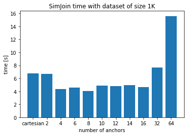

# CS422 - Database Systems - Project 2 report
### Group 20 - Camilla Giaccari 306083 - Dorian Laforest 234832

## Task 1 - Cube Operator

## Comparison between the naive algorithm and the MRCube

#### Discussion
As expected, we can see that for a fixed dataset and a fixed dimension the optimized algorithm performs better than the naive one, when we increment the number of reducers. At some threshold number of reducers it stops increasing the efficiency, because we overcome the number of parallel nodes.

#### Discussion
As expected, we can see that for a fixed amount of reducers and a fix sized dataset we have a better efficiency of the optimized algorithm compared to the naive one, because the optimized algorithm does not compute the group-bys from the raw data as the naive one.
For dimension 3 we can see that it is not the case and we think that it comes from experimental inaccuracy.

#### Discussion
We expect that for bigger datasets the optimized algorithm would outperform the naive one, while for smaller datasets we expect the naive one to be faster, but in this case we cannot draw any conclusion from the plot.

## Task 2 - Similarity join operator
### Plots and observation

#### Discussion
In theory we think that the more anchors we have, the less time the SimJoin algorithm should take. At some threshold number of anchors, where the number of partition would be larger than the number of parallel computing node available, it would stop being efficient.

We can see that for small datasets (eg. first graph), the cartesian version is not so much different from the SimJoin one because there is not a lot of data to split into multiple partitions.

For larger sets, we can see that using SimJoin is faster than the cartesian algorithm, because the SimJoin algorithm will not compute the cartesian product on the whole dataset but compute it on different filtered partitions, splitted among the cluster.

The more anchors we have, the slower is our algorithm and we think it comes from the implementation of the SimJoin algorithm : We were not able to avoid some pairs of record being sent to multiple partitions. This leads to unnecessary communication and computation between the partitions.
\pagebreak
## Task 3
Not implemented
